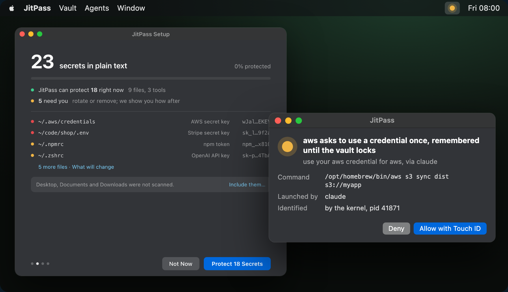
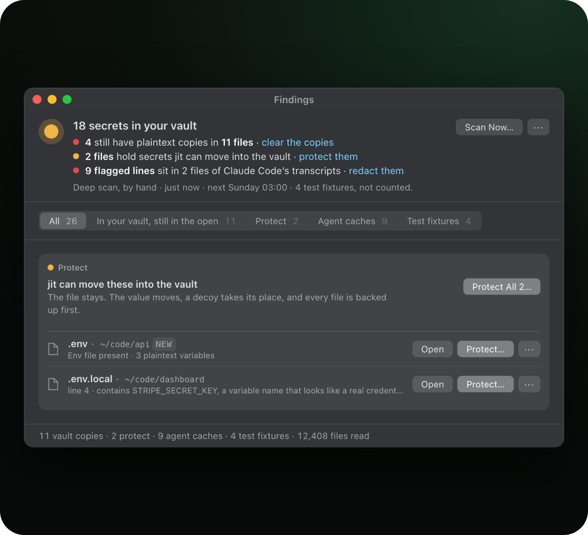
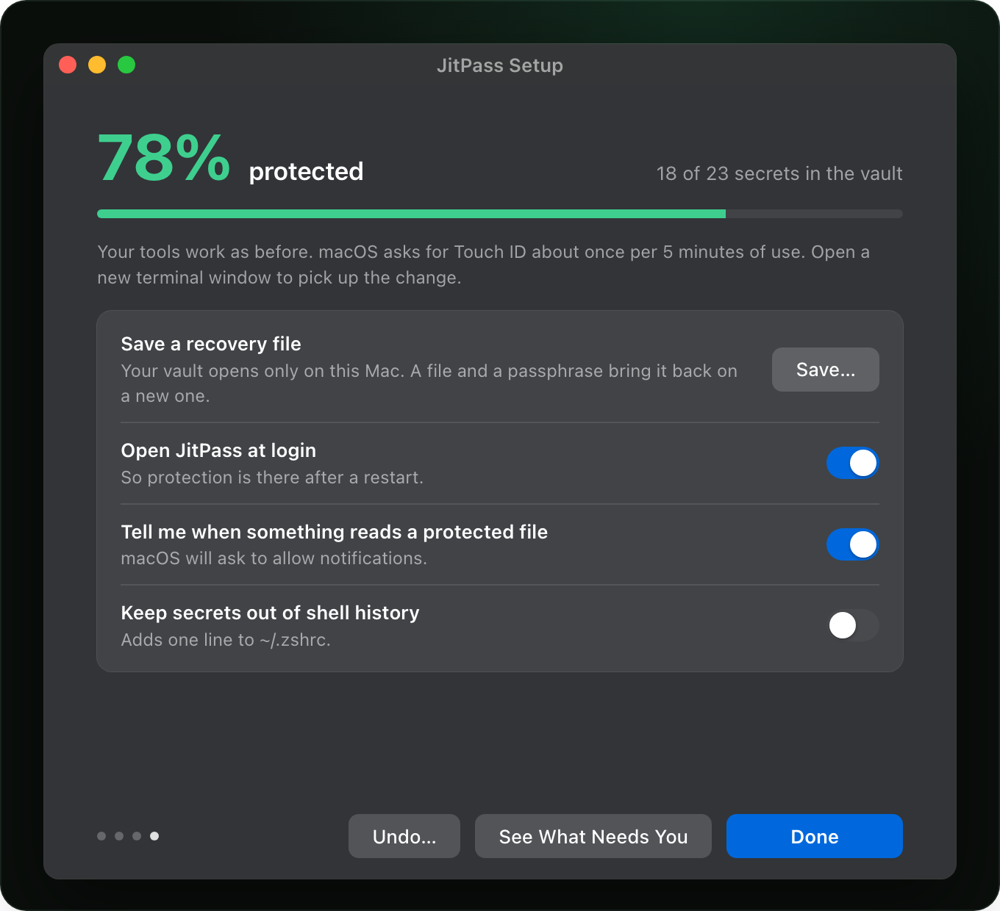
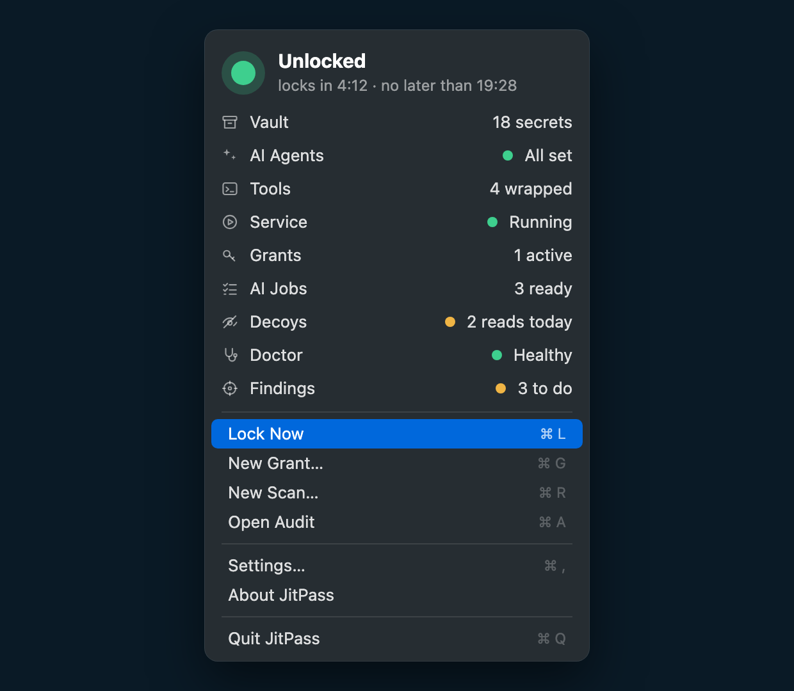
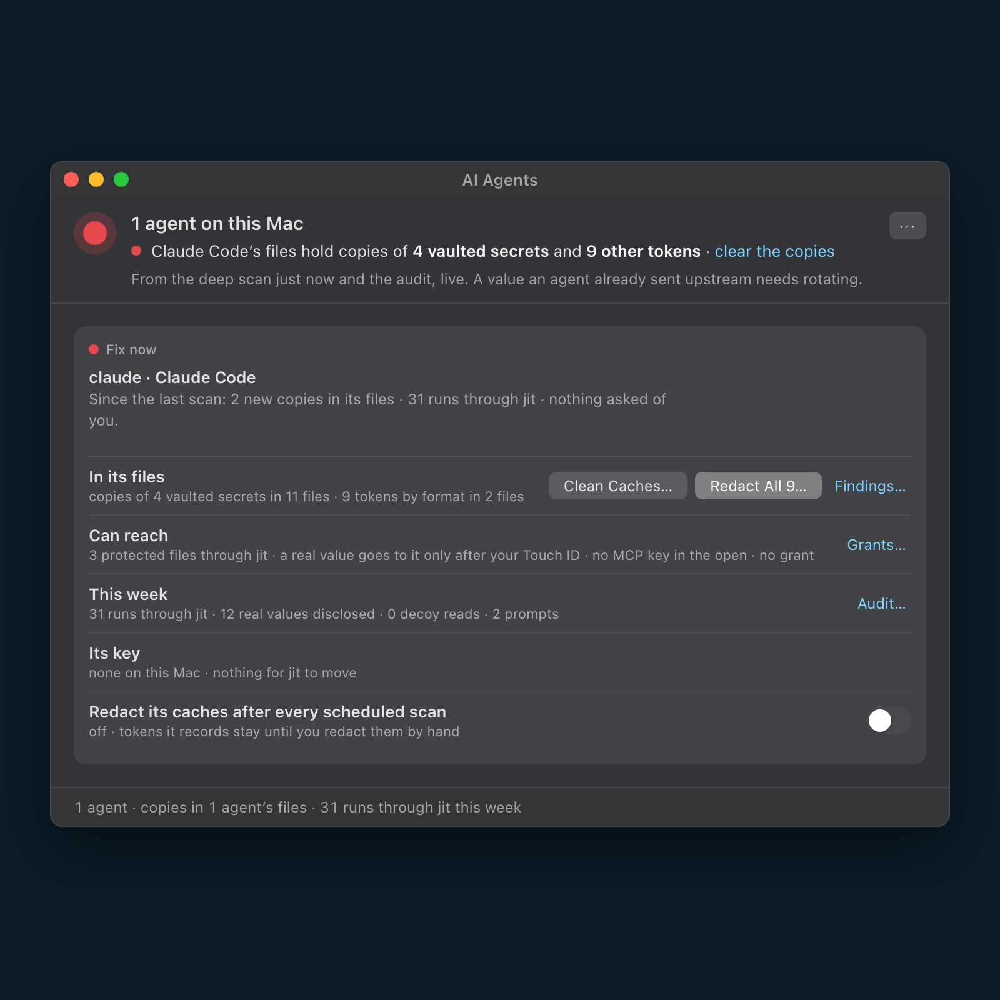
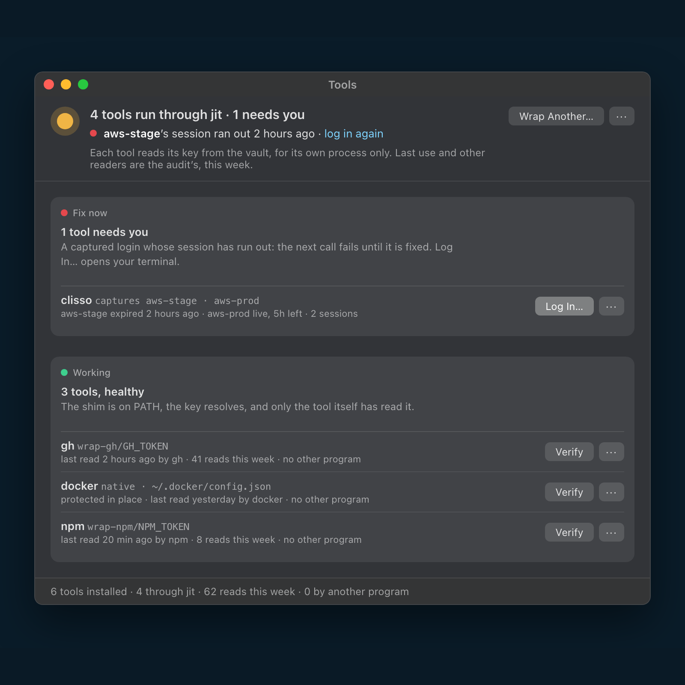

<p align="center">
  <picture>
    <source media="(prefers-color-scheme: dark)" srcset="docs/assets/readme/jitpass-mark-on-dark.svg">
    
  </picture>
</p>

<h1 align="center">JitPass for Mac</h1>

<p align="center">
  <b>You have API keys and tokens in plaintext on your Mac.<br>
  Use JitPass to protect them.</b>
</p>

<p align="center">
  <a href="https://github.com/jitpass/jit-app/releases/latest"></a>
  
  
</p>

<p align="center">
  <a href="https://dl.jitpass.com/jitpass/jit-app/releases/latest/download/JitPass-arm64.zip"><b>Download for Mac</b></a> ·
  <code>brew install jitpass/tap/jitpass</code> ·
  <a href="https://github.com/jitpass/jit">How it works</a> ·
  <a href="https://jitpass.com">jitpass.com</a>
</p>

<p align="center"><sub>Free for personal and internal company use · Source-available · No account · No telemetry · Nothing leaves your Mac · Secure Enclave ready</sub></p>

<p align="center">
  <a href="docs/assets/readme/hero.png"></a>
  <br>
  <sub><b>What's the number on your Mac?</b> The scan only reads, and changes nothing until you say so.</sub>
</p>

<p align="center">
  <b>Get started</b> &nbsp;
  <a href="#set-up-in-about-two-minutes">Set up</a> ·
  <a href="#install">Install</a>
  <br>
  <b>The app</b> &nbsp;
  <a href="#everything-in-one-click-of-the-menu-bar">The menu bar</a> ·
  <a href="#the-windows">The windows</a>
  <br>
  <b>More</b> &nbsp;
  <a href="https://github.com/jitpass/jit#readme">The full story</a> ·
  <a href="https://github.com/jitpass/jit#how-it-compares">How it compares</a> ·
  <a href="#for-contributors">For contributors</a>
</p>

JitPass is the menu bar app for [jit](https://github.com/jitpass/jit): it
moves the API keys and tokens on your Mac into a vault that opens with
Touch ID, and asks you before any program uses one.

## Set up in about two minutes

<table>
  <tr>
    <td width="33%" valign="top">
      <a href="docs/assets/readme/step-find.png"></a>
      <h3>1. Find</h3>
      Setup scans your Mac and changes nothing. It recognises <b>100+ token formats</b>, plus private keys and database URLs.
    </td>
    <td width="33%" valign="top">
      <a href="docs/assets/readme/step-finish.png"></a>
      <h3>2. Protect</h3>
      <b>One click</b> moves each secret into the vault and leaves a decoy. Every file is backed up first.
    </td>
    <td width="33%" valign="top">
      <a href="docs/assets/readme/step-approve.png"></a>
      <h3>3. Approve</h3>
      A program that wants a real key is named, with what launched it. <b>Allow with Touch ID</b>, or deny.
    </td>
  </tr>
</table>

<p align="center">
  <a href="https://dl.jitpass.com/jitpass/jit-app/releases/latest/download/JitPass-arm64.zip"><b>Download for Mac</b></a> ·
  <code>brew install jitpass/tap/jitpass</code><br>
  <sub>Free · No account · Every change can be undone</sub>
</p>

## Everything in one click of the menu bar

<a href="docs/assets/readme/panel.png"></a>

- **The ring tells you.** Green unlocked, red locked, amber a program is
  asking.
- **One click to see everything.** Your vault, your AI agents, your tools,
  grants, AI jobs, today's decoy reads and what is left to do.
- **Scans run on a schedule.** A new finding tells you once, and waits in
  Findings.
- **A vault key that never leaves your Mac.** Only the `jit` inside
  JitPass.app can keep the vault key in the Secure Enclave, the chip that
  holds keys and never lets them out. Opt-in from Settings › Protection, and
  reversible.
- **The app never sees a secret.** It is a window onto the jit service. Every
  button sends a request the `jit` CLI can also send, so the CLI keeps working
  without the app, headless and in CI.

<br clear="right">

## The windows

<table>
  <tr>
    <td width="50%" valign="top"><a href="docs/assets/readme/findings-sq.png"></a><br><b>Findings.</b> What is still in the open, and the one fix for each.</td>
    <td width="50%" valign="top"><a href="docs/assets/readme/agents-sq.png"></a><br><b>AI Agents.</b> Each agent on your Mac: keys in its files, what it can reach, what it did.</td>
  </tr>
  <tr>
    <td width="50%" valign="top"><a href="docs/assets/readme/ai-jobs-window-sq.png"></a><br><b>AI Jobs.</b> Let Claude or Cursor run a script you approved. They see the output, never the key.</td>
    <td width="50%" valign="top"><a href="docs/assets/readme/grants-window-sq.png"></a><br><b>Grants.</b> Let one agent work while you are away, and revoke it with one click.</td>
  </tr>
  <tr>
    <td width="50%" valign="top"><a href="docs/assets/readme/tools-sq.png"></a><br><b>Tools.</b> Every CLI jit protects, and proof that it is working.</td>
    <td width="50%" valign="top"><a href="docs/assets/readme/decoys-sq.png"></a><br><b>Decoys.</b> Who opened a protected file, and what they got.</td>
  </tr>
</table>

## Install

```sh
brew install jitpass/tap/jitpass
```

One cask installs JitPass into /Applications with the `jit` command line
inside it, linked onto PATH, plus shell completions.

Without Homebrew, [download the app](https://dl.jitpass.com/jitpass/jit-app/releases/latest/download/JitPass-arm64.zip),
drag it into Applications and open it. It offers to link `jit` onto your PATH
and checks for a newer release once a day; both live under
Settings › General. A copy opened straight from Downloads runs from a
temporary location, so the app asks to be moved first.

Upgrading from the old `jit-app` cask? Run `brew uninstall --cask jit-app`
first.

**The full story** (what gets protected, AI agents, how it works and what it
does not do) is in the **[jit README](https://github.com/jitpass/jit#readme)**.

---

## For contributors

### Build

Requires macOS 14+, Swift 5.10+ and full Xcode: `swift test` needs XCTest,
which the command line tools alone do not ship. `scripts/gate.sh` points
`DEVELOPER_DIR` at `/Applications/Xcode.app` for you. It also runs
`swiftformat` and `swiftlint`, so install both (`brew install swiftformat
swiftlint`).

```sh
scripts/gate.sh            # format, lint, build, test: the same steps CI runs
scripts/gate.sh --run      # and bundle and relaunch the dev build
swift run JitPass          # menu bar item appears; no Dock icon
scripts/bundle.sh release  # dist/JitPass.app, unsigned
```

Build through `scripts/gate.sh` rather than chaining the steps by hand: it
stops at the first step that fails.

### Release

The version is the bundled jit's: tag `v<jit.version>` (for example
`v2.2.8`), or `v<jit.version>.N` for a release that changes only the app
(`v2.2.8.1`). The workflow refuses a tag that disagrees with `jit.version`.
The bundled jit is fetched and verified at build time.

Push the tag. The workflow builds, Developer ID signs, notarizes and
staples the bundle, publishes a draft, verifies the published zip the way a
user's Mac will, undrafts, and renders the cask. The same steps run locally:

```sh
VERSION=2.2.8 scripts/bundle.sh release   # fetches and verifies the jit in jit.version first
scripts/sign.sh                           # Developer ID identity for team CZC6BH93GJ
NOTARY_KEY_FILE=... NOTARY_KEY_ID=... NOTARY_ISSUER_ID=... scripts/notarize.sh
scripts/verify.sh dist/JitPass-2.2.8-arm64.zip dist/checksums.txt
```

### Layout

```
Sources/JitAgentClient   socket client and protocol models, no AppKit, tested
Sources/JitPassApp       AppKit menu bar app, a view over JitAgentClient
Tests/JitAgentClientTests
Resources/               Info.plist, entitlements
scripts/                 bundle, sign, notarize, verify, cask
docs/design/             design docs and mockup sources
```

## License

[PolyForm Perimeter License 1.0.0](./LICENSE), the same source-available
license as jit: free for personal and internal use; it does not permit
building a competing product on it. Contributions are made under the
[CLA](./CLA.md); see [CONTRIBUTING.md](./CONTRIBUTING.md).
